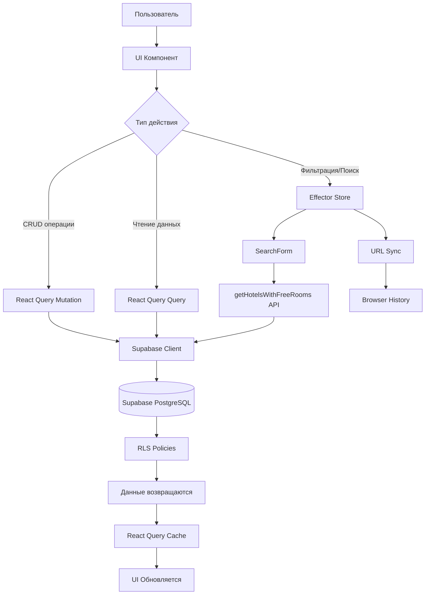
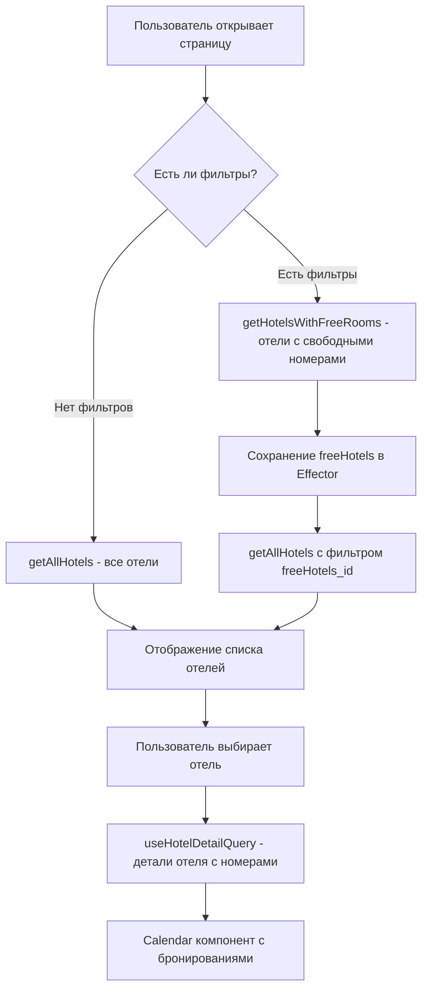

# Travel Time - Документация проекта

## 📋 Оглавление

1. [Общее описание](#общее-описание)
2. [Технологический стек](#технологический-стек)
3. [Архитектура приложения](#архитектура-приложения)
4. [Основные страницы и функционал](#основные-страницы-и-функционал)
5. [Бэкэнд часть](#бэкэнд-часть)
6. [Основные функциональные части](#основные-функциональные-части)
7. [Сложные и неочевидные места](#сложные-и-неочевидные-места)
8. [Проблемные места и ограничения](#проблемные-места-и-ограничения)
9. [Структура проекта](#структура-проекта)
10. [Настройка и запуск](#настройка-и-запуск)

---

## Общее описание

**Travel Time** — это веб-приложение для управления бронированием отелей. Система позволяет администраторам управлять отелями, номерами и бронированиями, а также предоставляет функционал поиска и фильтрации отелей с учетом доступности номеров на выбранные даты.

### Основные возможности:
- Управление отелями (создание, редактирование, просмотр)
- Управление номерами отелей
- Система бронирований с календарным отображением
- Расширенная фильтрация отелей по множеству параметров
- Поиск свободных номеров на выбранные даты
- Экспорт списка отелей для мессенджеров
- Аутентификация и авторизация пользователей

---

## Технологический стек

### Frontend

#### Основной стек
- **Next.js 15.5.7** — React-фреймворк с App Router
- **React 19.0.0** — UI библиотека
- **TypeScript 5** — типизация
- **Tailwind CSS 4** — стилизация
- **SCSS/SASS** — дополнительные стили

#### State Management
- **Effector 23.3.0** — управление состоянием приложения
  - Используется для глобального состояния (фильтры, данные отелей)
  - Поддержка эффектов и событий
  - Интеграция с React через `effector-react`
- **TanStack Query (React Query) 5.66.7** — серверное состояние
  - Кэширование запросов к API
  - Оптимистичные обновления
  - Infinite queries для пагинации

#### UI Компоненты
- **shadcn/ui** — компонентная библиотека на базе Radix UI
- **Radix UI** — примитивы для доступных компонентов
  - Dialog, Dropdown, Select, Popover, Tabs и др.
- **Lucide React** — иконки
- **React Icons** — дополнительные иконки

#### Формы и валидация
- **React Hook Form 7.62.0** — управление формами
- **Zod 3.25.76** — валидация схем
- **@hookform/resolvers** — интеграция Zod с React Hook Form

#### Календари и временные линии
- **my-react-calendar-timeline 0.30.0-beta.4** — календарь с временной шкалой для бронирований
- **react-day-picker 9.11.0** — выбор дат
- **date-fns 4.1.0** — работа с датами
- **dayjs 1.11.13** — альтернативная библиотека для дат
- **moment 2.30.1** — форматирование дат (dev dependency)

#### Drag & Drop
- **@dnd-kit** — библиотека для drag & drop операций
  - core, sortable, modifiers, utilities

#### Виртуализация
- **@tanstack/react-virtual 3.13.10** — виртуализация списков для производительности

#### Утилиты
- **lodash 4.17.21** — вспомогательные функции
- **classnames/clsx** — условные классы CSS
- **react-toastify 11.0.3** — уведомления
- **react-imask 7.6.1** — маски для ввода (телефоны и т.д.)

### Backend

#### База данных и Backend-as-a-Service
- **Supabase** — PostgreSQL база данных + Backend-as-a-Service
  - Аутентификация через Supabase Auth
  - Row Level Security (RLS) для безопасности
  - Realtime подписки (потенциально)
  - Storage для файлов (изображения отелей)

#### API
- **Supabase Client** — клиент для работы с базой данных
- **@supabase/ssr 0.6.1** — SSR поддержка для Next.js
- **@supabase/supabase-js 2.48.1** — основной клиент

### Инструменты разработки

- **ESLint** — линтер
- **Prettier** — форматирование кода
- **TypeScript** — статическая типизация
- **@effector/swc-plugin** — плагин для Effector в SWC

---

## Архитектура приложения

### Общая архитектура

```
┌─────────────────────────────────────────────────────────────┐
│                        Next.js App                          │
│  ┌──────────────────────────────────────────────────────┐  │
│  │              App Router (Next.js 15)                  │  │
│  │  ┌──────────────┐  ┌──────────────┐  ┌────────────┐ │  │
│  │  │   /main     │  │  /reservation│  │  /hotels   │ │  │
│  │  └──────────────┘  └──────────────┘  └────────────┘ │  │
│  └──────────────────────────────────────────────────────┘  │
│                                                              │
│  ┌──────────────────────────────────────────────────────┐  │
│  │              Features (Feature-Sliced Design)        │  │
│  │  ┌──────────────┐  ┌──────────────┐  ┌────────────┐ │  │
│  │  │  HotelModal  │  │   Calendar   │  │   Search   │ │  │
│  │  └──────────────┘  └──────────────┘  └────────────┘ │  │
│  └──────────────────────────────────────────────────────┘  │
│                                                              │
│  ┌──────────────────────────────────────────────────────┐  │
│  │         State Management Layer                        │  │
│  │  ┌──────────────┐              ┌──────────────┐     │  │
│  │  │   Effector   │              │ React Query  │     │  │
│  │  │  (Filters,  │              │  (API Cache) │     │  │
│  │  │   Global)    │              │              │     │  │
│  │  └──────────────┘              └──────────────┘     │  │
│  └──────────────────────────────────────────────────────┘  │
│                                                              │
│  ┌──────────────────────────────────────────────────────┐  │
│  │              API Layer (Supabase Client)              │  │
│  │  ┌──────────────┐  ┌──────────────┐  ┌────────────┐ │  │
│  │  │    Hotels    │  │    Rooms     │  │  Reserves  │ │  │
│  │  └──────────────┘  └──────────────┘  └────────────┘ │  │
│  └──────────────────────────────────────────────────────┘  │
└─────────────────────────────────────────────────────────────┘
                              │
                              ▼
                    ┌──────────────────┐
                    │   Supabase       │
                    │   PostgreSQL     │
                    │   + Auth         │
                    └──────────────────┘
```

### Диаграмма потока данных



### Структура состояния

#### Effector Stores
- `$hotelsFilter` — фильтры для поиска отелей
- `$filters` (AdvancedFilters) — расширенные фильтры
- `$freeHotelsData` — данные о свободных отелях
- `$user` — данные пользователя

#### React Query Cache
- `['hotels', 'list']` — список отелей
- `['hotels', id]` — детали отеля
- `['rooms', hotelId]` — номера отеля
- `['reserves', roomId]` — бронирования номера
- `['AUTH']` — сессия пользователя

---

## Основные страницы и функционал

### 1. Главная страница (`/`)

**Путь:** `src/app/page.tsx`

**Функционал:**
- Редирект на `/main` после проверки аутентификации
- Использует `useAuth()` для проверки сессии

**Особенности:**
- Если пользователь не авторизован, происходит редирект на `/login`

---

### 2. Страница входа (`/login`)

**Путь:** `src/app/login/page.tsx`

**Функционал:**
- Аутентификация пользователей
- Форма входа с email и password
- Регистрация новых пользователей

**Технологии:**
- Supabase Auth для аутентификации
- React Hook Form + Zod для валидации
- Server Actions для обработки формы

---

### 3. Главная панель (`/main`)

**Путь:** `src/app/main/page.tsx`

**Функционал:**
- Отображение статистики:
  - Количество отелей
  - Количество номеров
  - Количество бронирований
- Быстрое создание:
  - Добавление отеля
  - Добавление номера
  - Создание бронирования

**Компоненты:**
- `HotelInfoCard` — карточка с информацией об отелях
- `RoomInfoCard` — карточка с информацией о номерах
- `ReservationInfoCard` — карточка с информацией о бронированиях
- Модальные окна для создания сущностей

**API:**
- `useGetAllCounts()` — получение статистики

---

### 4. Страница бронирования (`/main/reservation`)

**Путь:** `src/app/main/reservation/page.tsx`

**Функционал:**
- Поиск и фильтрация отелей
- Отображение отелей с календарями бронирований
- Виртуализация списка для производительности
- Infinite scroll для подгрузки данных

**Ключевые особенности:**

#### Система фильтрации
1. **Базовые фильтры** (SearchForm):
   - Выбор отелей
   - Категория (тип номера)
   - Даты заезда/выезда
   - Количество гостей

2. **Расширенные фильтры** (AdvancedFilters):
   - Город
   - Особенности номера
   - Особенности размещения
   - Питание
   - Тип пляжа
   - Расстояние до пляжа
   - Ценовой диапазон

#### Логика запросов



**Виртуализация:**
- Используется `@tanstack/react-virtual` для оптимизации рендеринга
- Динамическая высота элементов на основе количества номеров
- IntersectionObserver для подгрузки новых данных

**Компоненты:**
- `SearchForm` — форма поиска
- `AdvancedFilters` — расширенные фильтры
- `Calendar` — календарь бронирований для каждого отеля
- `HotelCard` — карточка отеля (виртуализированная)
- `ExportHotelsButton` — экспорт списка отелей

**API:**
- `useInfiniteHotelsQuery()` — бесконечный запрос отелей
- `useHotelDetailQuery()` — детали конкретного отеля
- `getHotelsWithFreeRooms()` — поиск отелей с свободными номерами

---

### 5. Страница отелей (`/main/hotels`)

**Путь:** `src/app/main/hotels/page.tsx`

**Функционал:**
- Таблица всех отелей
- Редактирование отелей
- Просмотр номеров отеля
- Добавление нового отеля

**Компоненты:**
- `HotelsTable` — таблица отелей
- `HotelModal` — модальное окно для создания/редактирования

**API:**
- `useInfiniteHotelsQuery()` — получение всех отелей

---

### 6. Страница деталей отеля (`/main/hotels/[slug]`)

**Путь:** `src/app/main/hotels/[slug]/page.tsx`

**Функционал:**
- Детальная информация об отеле
- Список номеров отеля
- Управление номерами

---

### 7. Страница бронирования отеля (`/main/reservation/[slug]`)

**Путь:** `src/app/main/reservation/[slug]/page.tsx`

**Функционал:**
- Календарь бронирований для конкретного отеля
- Создание новых бронирований
- Редактирование существующих бронирований
- Просмотр деталей номеров

---

## Бэкэнд часть

### База данных Supabase

#### Основные таблицы

**hotels** — Отели
```typescript
{
  id: string (UUID, PK)
  title: string
  address: string
  city: string | null
  description: string
  phone: string
  rating: number | null
  telegram_url: string | null
  beach: string | null
  beach_distance: string | null
  eat: string[] | null
  features: string[] | null
  image_id: string | null
  type: string
  user_id: string | null
  created_at: timestamp
}
```

**rooms** — Номера
```typescript
{
  id: string (UUID, PK)
  hotel_id: string (FK -> hotels.id)
  title: string
  type: string
  price: number
  quantity: number
  order: number | null
  features: string[] | null
  created_at: timestamp
}
```

**reserves** — Бронирования
```typescript
{
  id: string (UUID, PK)
  room_id: string (FK -> rooms.id)
  start: number (Unix timestamp)
  end: number (Unix timestamp)
  guest: string
  phone: string
  price: number
  quantity: number
  prepayment: string | null
  comment: string | null
  created_at: timestamp
  created_by: string | null
  edited_at: timestamp | null
  edited_by: string | null
}
```

#### Views (Представления)

**hotels_with_rooms_new** — Отели с номерами
- Объединяет таблицы hotels и rooms
- Используется для оптимизации запросов

#### Row Level Security (RLS)

- Политики безопасности на уровне строк
- Ограничение доступа на основе user_id
- Автоматическая фильтрация данных по правам пользователя

### API слой

**Расположение:** `src/shared/api/`

#### Структура API

```
api/
├── auth/          # Аутентификация
├── hotel/         # Отели
├── room/          # Номера
├── reserve/       # Бронирования
├── supabase/      # Конфигурация Supabase
└── const.ts       # Константы (имена таблиц)
```

#### Основные функции API

**Hotels API** (`src/shared/api/hotel/hotel.ts`):
- `getAllHotels()` — получение всех отелей с пагинацией
- `getHotelsWithFreeRooms()` — поиск отелей с свободными номерами
- `useInfiniteHotelsQuery()` — React Query хук для бесконечного списка
- `useHotelDetailQuery()` — детали отеля
- `createHotel()` — создание отеля
- `updateHotel()` — обновление отеля
- `deleteHotel()` — удаление отеля

**Rooms API** (`src/shared/api/room/room.ts`):
- `getRoomsByHotel()` — получение номеров отеля
- `createRoom()` — создание номера
- `updateRoom()` — обновление номера
- `deleteRoom()` — удаление номера

**Reserves API** (`src/shared/api/reserve/reserve.ts`):
- `getReservesByHotels()` — получение бронирований для списка отелей
- `createReserve()` — создание бронирования
- `updateReserve()` — обновление бронирования
- `deleteReserve()` — удаление бронирования
- `useCreateReserve()` — React Query хук для создания
- `useUpdateReserve()` — React Query хук для обновления
- `useDeleteReserve()` — React Query хук для удаления

**Auth API** (`src/shared/api/auth/auth.ts`):
- `login()` — вход в систему
- `register()` — регистрация
- `useGetSession()` — получение текущей сессии

### Middleware

**Файл:** `middleware.ts`

**Функционал:**
- Обновление сессии Supabase на каждом запросе
- Обработка cookies для SSR
- Использует `@supabase/ssr` для корректной работы с Next.js

---

## Основные функциональные части

### 1. Система поиска и фильтрации

**Расположение:** `src/features/Search/`, `src/features/AdvancedFilters/`

#### Компоненты

**SearchForm** (`src/features/Search/ui/SearchForm.tsx`):
- Форма поиска с базовыми фильтрами
- Синхронизация с URL параметрами
- Интеграция с AdvancedFilters
- Вызов `getHotelsWithFreeRooms()` при поиске

**AdvancedFilters** (`src/features/AdvancedFilters/ui/AdvancedFilters.tsx`):
- Расширенные фильтры с аккордеонами
- Синхронизация с URL
- Интеграция с Effector stores
- Поддержка множественного выбора

#### Логика работы

1. **Инициализация фильтров:**
   - Из URL параметров при загрузке страницы
   - Из Effector store при изменении

2. **Применение фильтров:**
   - Базовые фильтры (даты, количество) → `getHotelsWithFreeRooms()`
   - Расширенные фильтры → применяются к результату базовых фильтров

3. **Синхронизация:**
   - Фильтры ↔ URL параметры
   - Фильтры ↔ Effector stores
   - Двусторонняя синхронизация

#### Effector Stores

```typescript
// src/features/AdvancedFilters/model/stores.ts
$filters: AdvancedFiltersState // Состояние всех фильтров
$isHydratingFromQuery: boolean // Флаг предотвращения циклов

// src/shared/models/hotels.ts
$hotelsFilter: TravelFilterType // Фильтры для поиска
```

#### События Effector

- `filterSet` — установка одного фильтра
- `filterRemoved` — удаление фильтра
- `filtersCleared` — очистка всех фильтров
- `filtersHydrated` — гидратация из URL

---

### 2. Календарь бронирований

**Расположение:** `src/features/Calendar/`, `src/features/BaseCalendar/`

#### Компоненты

**Calendar** (`src/features/Calendar/ui/Calendar.tsx`):
- Отображение номеров отеля в виде временной шкалы
- Визуализация бронирований на календаре
- Создание и редактирование бронирований
- Drag & drop для изменения дат (потенциально)

**BaseCalendar** (`src/features/BaseCalendar/ui/`):
- Базовый компонент календаря
- Использует `my-react-calendar-timeline`

#### Особенности

- **Группы:** Каждый номер — отдельная группа на временной шкале
- **Элементы:** Бронирования отображаются как элементы на шкале
- **Интерактивность:** Клик по бронированию открывает модальное окно редактирования
- **Валидация:** Проверка пересечений бронирований при создании

#### Данные

```typescript
interface CalendarData {
  groups: Array<{
    id: string; // room.id
    title: string; // room.title
  }>;
  items: Array<{
    id: string; // reserve.id
    group: string; // room.id
    title: string; // reserve.guest
    start_time: number; // reserve.start
    end_time: number; // reserve.end
  }>;
}
```

---

### 3. Система модальных окон

**Расположение:** `src/features/HotelModal/`, `src/features/RoomModal/`, `src/features/ReserveInfo/`

#### Компоненты

**HotelModal** (`src/features/HotelModal/ui/HotelModal.tsx`):
- Создание и редактирование отелей
- Валидация через Zod схемы
- Загрузка изображений
- Множественный выбор для массивов (features, eat и т.д.)

**RoomModal** (`src/features/RoomInfo/ui/RoomModal.tsx`):
- Создание и редактирование номеров
- Привязка к отелю
- Валидация цены и количества

**ReserveModal** (`src/features/ReserveInfo/ui/ReserveModal.tsx`):
- Создание и редактирование бронирований
- Выбор номера и дат
- Валидация пересечений с существующими бронями
- Расчет цены

#### Валидация

Все модальные окна используют:
- **React Hook Form** для управления формой
- **Zod** для валидации схем
- **@hookform/resolvers** для интеграции

Пример схемы валидации:
```typescript
// src/features/HotelModal/lib/validation.ts
const hotelSchema = z.object({
  title: z.string().min(1, "Название обязательно"),
  address: z.string().min(1, "Адрес обязателен"),
  phone: z.string().regex(/^\+?[1-9]\d{1,14}$/, "Неверный формат телефона"),
  // ...
});
```

---

### 4. Экспорт отелей

**Расположение:** `src/features/ExportHotels/`

#### Функционал

- Экспорт списка отелей в форматированный текст
- Автоматическое копирование в буфер обмена
- Форматирование для мессенджеров (Telegram, WhatsApp)
- Поддержка Markdown и plain text

#### Компоненты

**ExportHotelsButton** — кнопка для открытия модального окна
**ExportHotelsModal** — модальное окно с предпросмотром и копированием

#### Утилиты

- `formatHotelsForMessenger()` — форматирование с Markdown
- `formatHotelsAsPlainText()` — форматирование без Markdown
- `copyToClipboard()` — копирование в буфер обмена

---

### 5. Виртуализация списков

**Расположение:** Используется в `src/app/main/reservation/page.tsx`

#### Технология

- **@tanstack/react-virtual** — виртуализация для производительности
- **Window Virtualizer** — виртуализация относительно окна браузера

#### Реализация

```typescript
const virtualizer = useWindowVirtualizer({
  count: hotelsWithRooms.length,
  estimateSize: (index) => {
    // Динамический расчет высоты на основе количества номеров
    const hotel = hotelsWithRooms[index];
    const roomsCount = hotel.rooms?.length || 1;
    return headerHeight + calendarHeight;
  },
  overscan: 1,
});
```

#### Преимущества

- Рендеринг только видимых элементов
- Плавная прокрутка даже при большом количестве отелей
- Экономия памяти

---

### 6. Аутентификация и авторизация

**Расположение:** `src/shared/api/auth/`, `src/shared/lib/useAuth.ts`, `src/app/login/`

#### Механизм

1. **Вход:** `login()` → Supabase Auth → получение сессии
2. **Проверка:** `useAuth()` → проверка сессии → редирект если нет
3. **Middleware:** обновление сессии на каждом запросе
4. **Хранение:** сессия в cookies (управляется Supabase SSR)

#### Компоненты

- `Login` — страница входа
- `useAuth` — хук для проверки аутентификации
- `AuthController` — контроллер для защищенных страниц

#### Безопасность

- Row Level Security (RLS) в Supabase
- Фильтрация данных по `user_id`
- Защищенные маршруты через middleware

---

## Сложные и неочевидные места

### 1. Двунаправленная синхронизация фильтров

**Проблема:** Фильтры синхронизируются между:
- URL параметрами
- Effector stores
- React state в компонентах

**Решение:**
- Флаг `$isHydratingFromQuery` предотвращает циклы обновлений
- Последовательность: URL → Store → Component
- Использование `structuredClone` для иммутабельности

**Файлы:**
- `src/features/AdvancedFilters/model/init.ts`
- `src/features/AdvancedFilters/ui/FiltersSync.tsx`

---

### 2. Оптимизация запросов с фильтрами

**Проблема:** При применении фильтров нужно:
1. Найти отели с свободными номерами (`getHotelsWithFreeRooms`)
2. Применить расширенные фильтры к результату
3. Загрузить детали отелей с номерами и бронями

**Решение:**
- Двухэтапный процесс:
  1. `getHotelsWithFreeRooms()` → сохраняет `freeHotels_id` в фильтр
  2. `getAllHotels()` с фильтром `freeHotels_id` → применяет расширенные фильтры
- Кэширование результатов в React Query
- Оптимистичные обновления

**Файлы:**
- `src/shared/api/hotel/hotel.ts` (функции `getHotelsWithFreeRooms`, `getAllHotels`)

---

### 3. Виртуализация с динамической высотой

**Проблема:** Каждый отель имеет разное количество номеров, что влияет на высоту календаря.

**Решение:**
- Динамический расчет высоты на основе `rooms.length`
- Использование `measureElement` для точного измерения
- `useEffect` для пересчета при изменении данных

**Файлы:**
- `src/app/main/reservation/page.tsx` (компонент `HotelCard`)

---

### 4. Управление состоянием загрузки

**Проблема:** Множественные источники загрузки:
- Фильтры (Effector)
- API запросы (React Query)
- Детали отелей

**Решение:**
- Объединение состояний загрузки:
```typescript
const isInitialLoading = isLoading || isFreeHotelsLoading || isFilterLoading;
```
- Использование `keepPreviousData` в React Query для плавных переходов

---

### 5. Валидация пересечений бронирований

**Проблема:** Нужно проверить, что новое бронирование не пересекается с существующими.

**Решение:**
- Проверка на сервере через Supabase функции (потенциально)
- Проверка на клиенте перед отправкой
- Валидация через Zod с кастомными правилами

**Файлы:**
- `src/features/ReserveInfo/VALIDATION.md`
- `src/features/ReserveInfo/ui/ReserveModal.tsx`

---

### 6. Синхронизация данных между компонентами

**Проблема:** Данные об отелях используются в разных компонентах:
- Список отелей
- Календарь
- Модальные окна

**Решение:**
- React Query для кэширования и синхронизации
- Инвалидация кэша при изменениях:
```typescript
queryClient.invalidateQueries({ queryKey: ['hotels', 'list'] });
```
- Оптимистичные обновления для мгновенного UI

---

### 7. Работа с датами и временными метками

**Проблема:** Разные форматы дат:
- Unix timestamp в базе (число)
- Date объекты в React
- Строки для отображения

**Решение:**
- Конвертация при получении данных из API
- Использование `dayjs` и `date-fns` для форматирования
- Единые утилиты для конвертации

**Файлы:**
- `src/shared/lib/date.ts`
- `src/shared/lib/getDate.ts`

---

## Проблемные места и ограничения

### 1. Производительность при большом количестве отелей

**Проблема:**
- При загрузке всех отелей с номерами и бронями может быть медленно
- Виртуализация помогает, но не решает проблему полностью

**Текущее решение:**
- Infinite scroll с пагинацией
- Виртуализация списка
- Ленивая загрузка деталей отелей

**Рекомендации:**
- Рассмотреть серверную пагинацию
- Оптимизировать запросы к базе (индексы)
- Использовать React Query `select` для выборки только нужных полей

---

### 2. Сложность логики фильтрации

**Проблема:**
- Множественные источники фильтров
- Сложная синхронизация между компонентами
- Потенциальные баги при изменении фильтров

**Текущее решение:**
- Централизованное управление через Effector
- Документация в коде

**Рекомендации:**
- Рефакторинг для упрощения логики
- Добавление unit тестов для фильтров
- Выделение бизнес-логики в отдельный слой

---

### 3. Отсутствие типизации для некоторых частей

**Проблема:**
- Использование `@ts-expect-error` в некоторых местах
- Неполная типизация для Effector stores

**Примеры:**
```typescript
// src/shared/models/auth.ts
// @ts-expect-error
export const setUser = createEffect<User>();
```

**Рекомендации:**
- Обновить типы Effector
- Убрать `@ts-expect-error` где возможно
- Использовать правильные типы для событий и эффектов

---

### 4. Зависимость от бета-версии библиотеки

**Проблема:**
- `my-react-calendar-timeline@0.30.0-beta.4` — бета версия
- Потенциальные breaking changes при обновлении

**Рекомендации:**
- Закрепить версию в package.json
- Рассмотреть альтернативные библиотеки
- Подготовить план миграции при обновлении

---

### 5. Ограничения Supabase RLS

**Проблема:**
- Сложность настройки политик для сложных запросов
- Потенциальные проблемы с производительностью

**Рекомендации:**
- Документировать все RLS политики
- Тестировать производительность запросов
- Рассмотреть использование функций PostgreSQL для сложной логики

---

### 6. Управление изображениями

**Проблема:**
- Загрузка изображений через Supabase Storage
- Нет оптимизации изображений на клиенте
- Потенциально большие размеры файлов

**Рекомендации:**
- Добавить валидацию размера файлов
- Использовать Next.js Image для оптимизации
- Рассмотреть CDN для изображений

---

## Структура проекта

```
travel_time/
├── src/
│   ├── app/                    # Next.js App Router
│   │   ├── layout.tsx          # Корневой layout
│   │   ├── page.tsx            # Главная страница (редирект)
│   │   ├── login/              # Страница входа
│   │   └── main/               # Основные страницы
│   │       ├── page.tsx        # Панель управления
│   │       ├── hotels/         # Управление отелями
│   │       └── reservation/    # Бронирования
│   │
│   ├── features/               # Feature-Sliced Design
│   │   ├── AdvancedFilters/   # Расширенные фильтры
│   │   ├── Auth/               # Аутентификация
│   │   ├── Calendar/           # Календарь бронирований
│   │   ├── ExportHotels/       # Экспорт отелей
│   │   ├── HotelModal/         # Модальное окно отеля
│   │   ├── ReserveInfo/        # Информация о бронировании
│   │   ├── RoomInfo/           # Информация о номере
│   │   ├── Search/             # Поиск
│   │   └── ...
│   │
│   ├── shared/                 # Общие модули
│   │   ├── api/                # API слой
│   │   │   ├── auth/           # Аутентификация
│   │   │   ├── hotel/          # Отели
│   │   │   ├── room/           # Номера
│   │   │   ├── reserve/        # Бронирования
│   │   │   └── supabase/       # Конфигурация Supabase
│   │   ├── config/             # Конфигурация
│   │   │   ├── reactQuery.ts   # React Query настройки
│   │   │   ├── routes.ts       # Маршруты
│   │   │   └── supabase.ts     # Supabase клиент
│   │   ├── lib/                # Утилиты
│   │   ├── models/             # Effector модели
│   │   └── ui/                 # Общие UI компоненты
│   │
│   ├── components/             # Глобальные компоненты
│   │   ├── ui/                 # shadcn/ui компоненты
│   │   └── SafeHydrate/        # Безопасная гидратация
│   │
│   └── utils/                  # Утилиты
│
├── supabase/
│   └── migrations/             # Миграции базы данных
│
├── public/                     # Статические файлы
├── database.types.ts           # Типы из Supabase (автогенерация)
├── middleware.ts               # Next.js middleware
├── next.config.ts              # Конфигурация Next.js
├── tailwind.config.js          # Конфигурация Tailwind
└── package.json                # Зависимости
```

### Feature-Sliced Design

Проект следует принципам Feature-Sliced Design:

- **features/** — изолированные фичи приложения
- **shared/** — переиспользуемые модули
- **app/** — точки входа (страницы)
- **components/** — глобальные компоненты

Каждая фича может содержать:
- `ui/` — компоненты интерфейса
- `model/` — бизнес-логика (Effector stores, events)
- `lib/` — утилиты фичи
- `api/` — API запросы фичи

---

## Настройка и запуск

### Требования

- Node.js >= 18.0.0
- npm или yarn
- Аккаунт Supabase

### Установка

```bash
# Установка зависимостей
npm install

# Настройка переменных окружения
# Создайте .env.local с:
NEXT_PUBLIC_SUPABASE_URL=your_supabase_url
NEXT_PUBLIC_SUPABASE_ANON_KEY=your_supabase_anon_key
```

### Запуск

```bash
# Разработка
npm run dev

# Сборка
npm run build

# Запуск production
npm start
```

### Генерация типов

```bash
# Обновление типов из Supabase
npm run supabase:update-types
```

### Полезные команды

```bash
# Очистка и перезапуск
npm run dev:clean

# Форматирование кода
npm run format

# Проверка форматирования
npm run format:check

# Линтинг
npm run lint
```

---

## Дополнительные ресурсы

### Документация фич

- `src/features/ExportHotels/README.md` — документация экспорта отелей
- `src/features/ExportHotels/ARCHITECTURE.md` — архитектура экспорта
- `src/features/HotelModal/VALIDATION.md` — валидация отелей
- `src/features/ReserveInfo/VALIDATION.md` — валидация бронирований

### Полезные файлы

- `database.types.ts` — актуальные типы базы данных (генерируется автоматически)
- `CHANGELOG.md` — история изменений
- `TAILWIND_FAQ.md` — FAQ по Tailwind
- `WINDOWS_EPERM_FIX.md` — решение проблем на Windows

---

## Контакты и поддержка

При возникновении вопросов обращайтесь к документации фич или кода. Большинство сложных мест имеют комментарии и документацию в соответствующих файлах.
